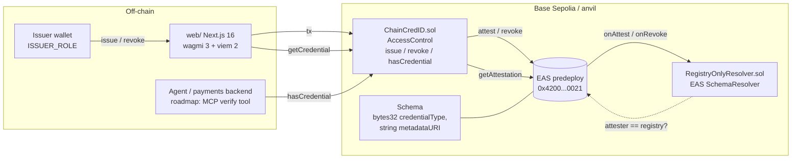

# ChainCredID

**Know who you are paying before the money moves.**

ChainCredID is an issuer-signed credential registry on the [Ethereum Attestation Service](https://attest.org)
(EAS). A human, a payments backend, or an AI agent asks one question about a wallet,
`hasCredential(subject, type)`, and gets an answer computed from EAS state: not from this app, not from a
database. Credentials are typed, revocable, and expiring, and every re-issue links to the one before it.

> Testnet project. Nothing here has been audited or deployed to mainnet.

**Links**

| | |
|---|---|
| Landing page (what it does, four animated examples) | `/` https://chaincredid.pages.dev |
| Verify any wallet | `/verify` |
| Issuer console | `/issue` |
| Source | https://github.com/maxsorto/ChainCredID |
| Full 2026 review of the 2024 code | [ASSESSMENT.md](./ASSESSMENT.md) |

---

## Lore: ETH Latam 2024, San Pedro Sula

ChainCredID started as a 48-hour hackathon project at the third edition of ETH Latam, held March 13 and 14,
2024 in San Pedro Sula, Honduras, with more than 1,100 attendees. The team was three people:

- **Max Sorto**: the smart contract and the user and admin portals.
- **Jorge Ramírez**: the README and a Chainlink Automation voting side-demo for a sponsor track.
- **cc0mfer**: homepage and branding.

The 2024 version was a citizen-rights demo. One contract, `CitizenDatabase.sol`, let an admin flip three
booleans per wallet, `canVote`, `canDrink`, and `canEnterCountry`, and fired an EAS attestation on Scroll
Sepolia as a side effect. The frontend was four static HTML pages loading ethers 5 from a CDN, deployed to
`chaincredid.pages.dev`.

It won a top prize. In an 18 April 2024 interview with La Prensa, Jorge described the result as
"uno de los primeros lugares" at the ETH Latam hackathon
([article](https://www.laprensa.hn/honduras/honduras-abrir-puertas-nuevas-tecnologias-jorge-ramirez-MI18769511)).
We say "a top prize" here because that is what the record supports.

The 2024 tree is preserved at the git tag [`hackathon-2024`](https://github.com/maxsorto/ChainCredID/tree/hackathon-2024).

## What was wrong with it

Normal hackathon debt, listed plainly because the fixes are the point of the 2026 version:

- `main` did not compile: the EAS contracts dependency was never added to `package.json`.
- No tests for the real contract. The Hardhat template `Lock.sol` and its tests were still in the tree.
- No access control. Anyone could grant anyone voting rights.
- `require(!canVote); canVote = _canVote;` let `false` through and still attested.
- The attestation payload was just the address, so all three rights produced identical attestations.
- Attestations were non-revocable and had no expiry.
- Verification read a local mapping. EAS was written to but never read back, which defeats the purpose of
  using it.

## Why bring it back in 2026

The identity problem moved. In 2024 it was citizens; in 2026 it is agents. ERC-8004 gives an agent an
onchain identity and reputation, x402 lets it pay over HTTP with stablecoins, and "Know Your Agent" has
become a compliance line item at payments companies. What none of those answer is who vouches for the
agent, or for the merchant it is about to pay.

Meanwhile EAS became the substrate that won: a predeploy on Base and the OP Stack, and the layer under
Coinbase Verifications and most onchain reputation. Betting on EAS in 2024 was right. Using it as a
write-only side effect was not.

The salvageable core was an issuer-gated EAS schema for typed, revocable, expiring credentials, plus a
verifier that reads EAS. That is what this branch builds. The full landscape review, including what World
ID, zkPassport, Coinbase Verifications, and EIP-7702 changed, is in [ASSESSMENT.md](./ASSESSMENT.md).

## What changed

| | Hackathon (March 2024) | This repo (September 2026) |
|---|---|---|
| Toolchain | Hardhat 2.22, did not compile on `main` | Foundry (forge 1.5), solc 0.8.28, Node 24 |
| Dependencies | EAS dep missing | forge-std v1.16.2, OpenZeppelin v5.6.1, EAS contracts v1.4.0 as submodules |
| Credential model | Three hardcoded booleans | Generic `bytes32` credential types (`keccak256` of a name) |
| Access control | None | `AccessControl` with `ISSUER_ROLE` |
| Lifecycle | Non-revocable, no expiry | Revocable and expiring; re-issue links to the previous attestation through `refUID` |
| Schema | Open; anyone could attest under it | `RegistryOnlyResolver` rejects any attester that is not the registry |
| Verification | Read a local mapping | `hasCredential` derives active/inactive from the attestation's revocation and expiration times on EAS |
| Payload | Bare address | `abi.encode(bytes32 credentialType, string metadataURI)` |
| Tests | Template tests only | 23 Forge tests (21 unit, 2 fuzz) that deploy real EAS bytecode in `setUp` |
| Frontend | 4 static HTML files, ethers 5 UMD, MetaMask only | Next.js 16, React 19, TypeScript, wagmi 3, viem 2, any injected wallet |
| Pages | Two portals | `/` landing with four animated scenes, `/verify`, `/issue` |
| Chain | Scroll Sepolia | Base Sepolia (EAS predeploy) and local anvil |
| Config | Addresses hardcoded in HTML | `NEXT_PUBLIC_*` env with `.env.example` files; deploys use a keystore |
| CI | None | GitHub Actions: `forge fmt`, `forge build`, `forge test`; `tsc`, `eslint`, `next build` |

## Architecture



**Why a resolver?** Anyone can attest under any EAS schema. `RegistryOnlyResolver` rejects attestations
whose attester is not the registry, so a verifier who sees an attestation with this schema UID knows it
went through the issuer-gated path. Credentials are still plain EAS attestations, so EASScan, indexers,
and other contracts can consume them without knowing about ChainCredID.

**Why not just a mapping?** The registry stores one pointer per `(subject, type)`: the attestation UID.
Active or inactive is derived from the attestation's `revocationTime` and `expirationTime`. Re-issues
point at their predecessor through `refUID`, so a credential's history is a chain on EAS.

### Contract surface

| Function | Who | What |
|---|---|---|
| `issue(subject, type, expiration, uri) -> uid` | `ISSUER_ROLE` | Revocable EAS attestation, payload `abi.encode(type, uri)`, `refUID` = previous credential of the same type. Reverts if an active one exists. |
| `revoke(subject, type)` | `ISSUER_ROLE` | Revokes on EAS. The UID is kept for audit. |
| `hasCredential(subject, type) -> bool` | anyone | Exists, not revoked, not expired, read from EAS. |
| `getCredential(subject, type)` | anyone | Full `Attestation`, decoded URI, and `active`. |
| `credentialTypeId(name) -> bytes32` | anyone | `keccak256(bytes(name))`, so UIs and agents agree on ids. |

Credential types are open-ended. The demo UI offers `OPERATOR_KYC`, `AGENT_REGISTERED`,
`SPEND_LIMIT_USDC_1000`, and `MERCHANT_VERIFIED`. The registry answers yes or no; amount limits and
other policy live in the payments code that reads it.

### Repository layout

```
contracts/     Foundry project: src/, test/, script/, foundry.toml
web/           Next.js 16 app: / (landing), /verify, /issue
.github/       CI for contracts and web
ASSESSMENT.md  The September 2026 review written before the rework
front/assets   2024 branding assets
```

## Run it locally

Prereqs: [Foundry](https://getfoundry.sh) (stable) and Node 24 (`.node-version`; Node 22 also works).

```bash
git clone --recursive https://github.com/maxsorto/ChainCredID.git
cd ChainCredID

# 1. contracts
cd contracts
forge test                     # 23 tests incl. fuzz, against real EAS bytecode deployed in setUp
anvil                          # in a second terminal
forge script script/Deploy.s.sol --rpc-url anvil --broadcast \
  --unlocked --sender 0xf39Fd6e51aad88F6F4ce6aB8827279cffFb92266   # anvil account #0, no key needed
# prints EAS, SchemaRegistry, Resolver, ChainCredID addresses and the schema UID

# 2. web
cd ../web
cp .env.example .env.local     # paste the ChainCredID address into NEXT_PUBLIC_REGISTRY_ADDRESS_LOCAL
npm install
npm run dev                    # http://localhost:3000 is the landing; /verify and /issue read chain 31337
```

Add anvil to your wallet as a custom network (`http://127.0.0.1:8545`, chain id 31337). The deployer is
admin and issuer by default; `/issue` shows whether the connected wallet holds `ISSUER_ROLE`. To grant
another issuer:

```bash
cast send <REGISTRY> "grantRole(bytes32,address)" $(cast keccak ISSUER_ROLE) <WALLET> \
  --rpc-url anvil --unlocked --from 0xf39Fd6e51aad88F6F4ce6aB8827279cffFb92266
```

To issue from the command line instead of the console:

```bash
cast send <REGISTRY> "issue(address,bytes32,uint64,string)" <SUBJECT> $(cast keccak OPERATOR_KYC) 0 "ipfs://evidence" \
  --rpc-url anvil --unlocked --from 0xf39Fd6e51aad88F6F4ce6aB8827279cffFb92266
cast call <REGISTRY> "hasCredential(address,bytes32)(bool)" <SUBJECT> $(cast keccak OPERATOR_KYC) --rpc-url anvil
```

## Deploy to Base Sepolia

EAS is an OP Stack predeploy, so only the resolver, the schema, and the registry are deployed:

```bash
cd contracts && cp .env.example .env         # EAS_ADDRESS and SCHEMA_REGISTRY_ADDRESS are prefilled:
                                             # 0x4200000000000000000000000000000000000021 / ...0020
cast wallet import deployer --interactive    # keystore, never a raw key in env
forge script script/Deploy.s.sol --rpc-url base_sepolia --broadcast --account deployer --sender <ADDR>
```

Then set `NEXT_PUBLIC_REGISTRY_ADDRESS_BASE_SEPOLIA` in `web/.env.local` (and in the Cloudflare Pages project).
Attestations appear on [base-sepolia.easscan.org](https://base-sepolia.easscan.org). The landing page footer
links to the registry's EASScan page once that address is set.

## Roadmap

The direction the assessment recommends: credentials for AI agents and their operators, so a payments
stack can ask an EAS-backed question before it settles.

1. **MCP verifier** (`mcp/`): a stdio MCP server exposing `verify_credential`, `list_credentials`, and
   `issue_credential` (testnet, issuer key from env), so an agent can gate its own actions, for example
   "check `MERCHANT_VERIFIED` before paying this x402 endpoint," and a backend can ask "is this agent's
   operator KYC'd?" with one tool call.
2. **Base Sepolia deployment**, registry address and EASScan schema link in this README, and the web app on
   Cloudflare Pages.
3. **ERC-8004 binding**: accept an `agentId` as the subject, resolve it through the ERC-8004 Identity
   Registry to the agent wallet, and let `AGENT_REGISTERED` reference the registration file hash.
   Reputation stays on ERC-8004; issuer-signed claims stay here.
4. **Self-serve human credentials**: mint `OPERATOR_KYC`, age, or residency from a zkPassport or Self
   proof instead of an admin, so the human side of the trust chain does not depend on a single issuer.
5. **Passkey and smart-account UX**: EIP-7702 or ERC-4337 accounts with session keys, so the wallet a
   credential attaches to is the same account that carries spend policy.

## Credits

2024 team: Max Sorto (contracts, user and admin portals), Jorge Ramírez (README, Chainlink Automation
voting demo), cc0mfer (homepage, branding). 2026 rework: Max Sorto.

## License

MIT
