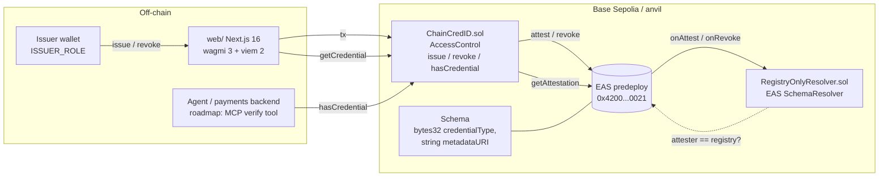

# ChainCredID

Issuer-signed, revocable, expiring credentials for wallets, including the wallets AI agents
transact from, built on the [Ethereum Attestation Service](https://attest.org) (EAS). An issuer with
`ISSUER_ROLE` calls `issue(subject, credentialType, expiration, evidenceURI)`; the registry writes a
typed EAS attestation under a closed schema; anyone (a dApp, a payments backend, an agent's tool) calls
`hasCredential(subject, type)` and gets a yes/no that is computed from EAS state, not from the
registry's own bookkeeping. Won a top prize at [ETH Latam 2024](https://taikai.network/en/ethlatam/hackathons/honduras)
(San Pedro Sula, Honduras) as a citizen-rights demo; re-cut in September 2026 around agent and operator
credentials.

> Testnet project. Nothing here has been audited or deployed to mainnet.

## Architecture



**Why a resolver?** Anyone can attest under any EAS schema. `RegistryOnlyResolver` rejects attestations
whose attester is not the registry, so a verifier who sees an attestation with this schema UID knows it
went through the issuer-gated path. Credentials are still plain EAS attestations, so EASScan, indexers
and other contracts can consume them without knowing about ChainCredID.

**Why not just a mapping?** The 2024 version stored booleans in its own storage and only *also* wrote to
EAS. The 2026 version stores one pointer (`subject => type => attestation UID`) and derives
active/inactive from the attestation's `revocationTime` and `expirationTime`. Re-issues link to their
predecessor through `refUID`, so the history of a credential is a chain on EAS.

## Repository layout

```
contracts/   Foundry project: src/, test/, script/, foundry.toml (solc 0.8.28, OZ 5.6.1, EAS 1.4.0)
web/         Next.js 16 app: /  (landing, animated examples)   /verify  (any wallet)   /issue  (issuer console)
.github/     CI: forge fmt/build/test + tsc/eslint/next build
ASSESSMENT.md  Honest state-of-the-repo review written before the 2026 rework
```

## Run it locally

Prereqs: [Foundry](https://getfoundry.sh) (stable) and Node 24 (`.node-version`; Node 22 also works).

```bash
git clone --recursive https://github.com/maxsorto/ChainCredID.git
cd ChainCredID

# 1. contracts
cd contracts
forge test                     # 23 tests incl. fuzz, against real EAS bytecode deployed in setUp
anvil                          # in a second terminal
forge script script/Deploy.s.sol --rpc-url anvil --broadcast \
  --unlocked --sender 0xf39Fd6e51aad88F6F4ce6aB8827279cffFb92266   # anvil account #0, no key needed
# prints EAS, SchemaRegistry, Resolver, ChainCredID addresses and the schema UID

# 2. web
cd ../web
cp .env.example .env.local     # paste the ChainCredID address into NEXT_PUBLIC_REGISTRY_ADDRESS_LOCAL
npm install
npm run dev                    # http://localhost:3000 (landing), /verify with an injected wallet on chain 31337
```

Deployer is admin and issuer by default; the `/issue` page shows whether your connected wallet holds
`ISSUER_ROLE`. To grant another issuer:

```bash
cast send <REGISTRY> "grantRole(bytes32,address)" $(cast keccak ISSUER_ROLE) <WALLET> \
  --rpc-url anvil --unlocked --from 0xf39Fd6e51aad88F6F4ce6aB8827279cffFb92266
```

### Base Sepolia

EAS is an OP Stack predeploy, so no EAS deployment is needed:

```bash
cd contracts && cp .env.example .env    # EAS_ADDRESS / SCHEMA_REGISTRY_ADDRESS are prefilled
cast wallet import deployer --interactive   # keystore, never a raw key in env
forge script script/Deploy.s.sol --rpc-url base_sepolia --broadcast --account deployer --sender <ADDR>
```

Then set `NEXT_PUBLIC_REGISTRY_ADDRESS_BASE_SEPOLIA` in `web/.env.local`. Attestations show up on
[base-sepolia.easscan.org](https://base-sepolia.easscan.org).

## Contract surface

| Function | Who | What |
|---|---|---|
| `issue(subject, type, expiration, uri) -> uid` | `ISSUER_ROLE` | Revocable EAS attestation, payload `abi.encode(type, uri)`, `refUID` = previous credential of same type. Reverts if an active one exists. |
| `revoke(subject, type)` | `ISSUER_ROLE` | Revokes on EAS. UID is kept for audit. |
| `hasCredential(subject, type) -> bool` | anyone | Exists, not revoked, not expired (read from EAS). |
| `getCredential(subject, type)` | anyone | Full `Attestation` + decoded URI + `active`. |
| `credentialTypeId(name) -> bytes32` | anyone | `keccak256(bytes(name))`, so UIs and agents agree on ids. |

Credential types are open-ended `bytes32`s. The demo UI offers `OPERATOR_KYC`, `AGENT_REGISTERED`,
`SPEND_LIMIT_USDC_1000`, `MERCHANT_VERIFIED`.

## 2024 vs 2026

| | Hackathon (March 2024) | This branch (September 2026) |
|---|---|---|
| Chain | Scroll Sepolia | Base Sepolia (EAS predeploy, Coinbase Verifications live there) + anvil |
| Toolchain | Hardhat 2.22, template `Lock.sol` still in tree, EAS dep missing so it did not compile | Foundry (forge 1.5), solc 0.8.28, OZ 5.6.1, EAS 1.4.0 as submodules |
| Contract | `CitizenDatabase`: 3 hardcoded booleans, no access control, guard let `false` through, attestation payload was just the address, non-revocable, verified from local mapping | `ChainCredID`: generic typed credentials, `AccessControl`, revocable + expiring, typed payload, verification reads EAS, closed schema via resolver |
| Tests | Hardhat template tests for `Lock` only | 23 Forge tests (unit + fuzz) against real EAS bytecode |
| Frontend | 4 static HTML files, ethers v5 UMD from a dead CDN, inline 5 KB ABI, MetaMask-only | Next.js 16 / React 19 / TypeScript, wagmi 3 + viem 2, human-readable ABI, any injected wallet |
| Secrets | none leaked (checked full history) | addresses via `NEXT_PUBLIC_*` env; deploy via keystore |
| CI | none | GitHub Actions: contracts + web |
| Voting / Chainlink Automation | separate demo for the sponsor track, source never merged to `main` | dropped; see git tag `hackathon-2024` |

The 2024 code is preserved at tag `hackathon-2024`. The full review is in [ASSESSMENT.md](./ASSESSMENT.md).

## Roadmap

The direction recommended in the assessment: **credentials for AI agents and their operators**, i.e.
"Know Your Agent" as an EAS primitive that a payments stack can query before settling.

1. **MCP verifier** (`mcp/`): stdio MCP server exposing `verify_credential`, `list_credentials` and
   `issue_credential` (testnet, issuer key from env), so a Claude / OpenClaw / Hermes agent can gate its
   own actions ("check `MERCHANT_VERIFIED` before paying this x402 endpoint") and a backend can ask
   "is this agent's operator KYC'd?" with one tool call.
2. **ERC-8004 binding**: accept an `agentId` as the subject, resolve it through the ERC-8004 Identity
   Registry to the agent wallet, and let `AGENT_REGISTERED` reference the registration file hash.
   Reputation stays on ERC-8004; issuer-signed claims stay here.
3. **Self-serve human credentials**: mint `OPERATOR_KYC` / age / residency from a zkPassport or Self
   proof instead of an admin, so the human side of the trust chain does not depend on a trusted issuer.
4. **Passkey / smart-account UX**: EIP-7702 or ERC-4337 accounts with session keys so the agent wallet
   the credential attaches to is the same account that carries spend policy.
5. Base Sepolia deployment + EASScan schema link in this README, and a redeploy of the web app to
   `chaincredid.pages.dev`.

## Team (2024)

Max Sorto (contracts, user/admin portals), Jorge Ramirez (Chainlink Automation voting demo, README),
cc0mfer (homepage, branding). 2026 rework by Max Sorto.

## License

MIT
